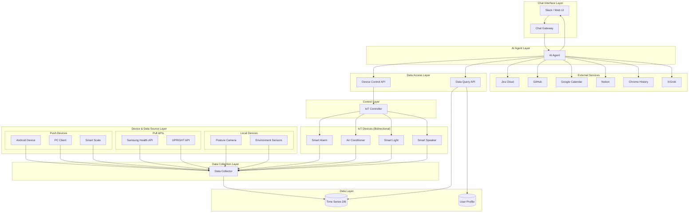

# アーキテクチャ概要

## システム構成図

## アーキテクチャ設計の指針

### 1. AI Agent中心設計

- **ユーザー指示はSlack経由（本番）またはWeb UI（開発用）**でAI Agentが受信
- AI Agent（Gemini CLI/Claude Code）が自律的に判断・実行
- AI Agent内部でコンテキスト収集・アクション決定・実行を一元管理
- データ収集は決められたルールで自動実行（AI介在なし）

### 2. タスク管理の一元化

- **すべてのタスクはJira Cloudで管理**（Task DBは使用しない）
- AI AgentがJira APIを直接操作
- タスクの作成、更新、分解はすべてJira上で実行

### 3. IoTデバイスの双方向制御

- データ収集だけでなく、**AI Agentからの制御も可能**
- カレンダー連携による自動制御
- ユーザーの行動パターンに基づく最適化

### 4. データ収集とアクセスの分離

- **Collector層**：デバイスからのデータを自動収集・格納（AIは介在しない）
  - Push型：認証が必要なデバイスからの能動的送信
  - Pull型：外部APIからの定期取得
  - ローカル型：Gateway不要のローカルネットワーク内収集
- **Data API層**：AI Agentがクエリを投げてデータを取得
  - 時系列データ、ヘルスデータ、行動ログへの統一的アクセス
  - AI Agentが必要なデータを自律的に判断して取得

### 5. セキュリティ・プライバシー考慮

- AI Agentには基本的に読み取り専用権限
- 制御が必要な場合のみ書き込み権限を付与
- 個人情報の暗号化とアクセス制御
