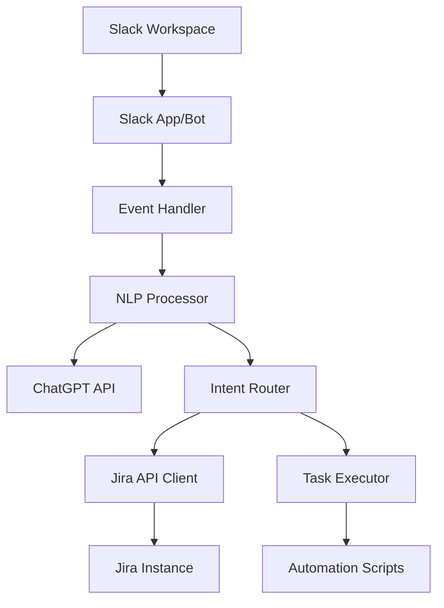

# アーキテクチャ概要

## システム構成図

```mermaid
graph TB
    Slack[Slack Workspace] --> SlackApp[Slack App/Bot]
    SlackApp --> EventHandler[Event Handler]
    EventHandler --> NLPProcessor[NLP Processor]
    NLPProcessor --> ChatGPT[ChatGPT API]
    NLPProcessor --> IntentRouter[Intent Router]
    IntentRouter --> JiraClient[Jira API Client]
    IntentRouter --> TaskExecutor[Task Executor]
    JiraClient --> Jira[Jira Instance]
    TaskExecutor --> Scripts[Automation Scripts]
```
