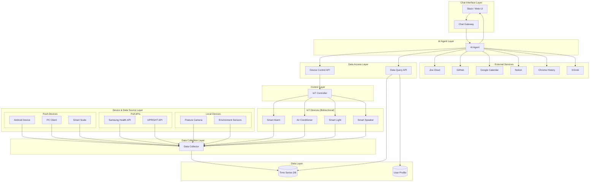
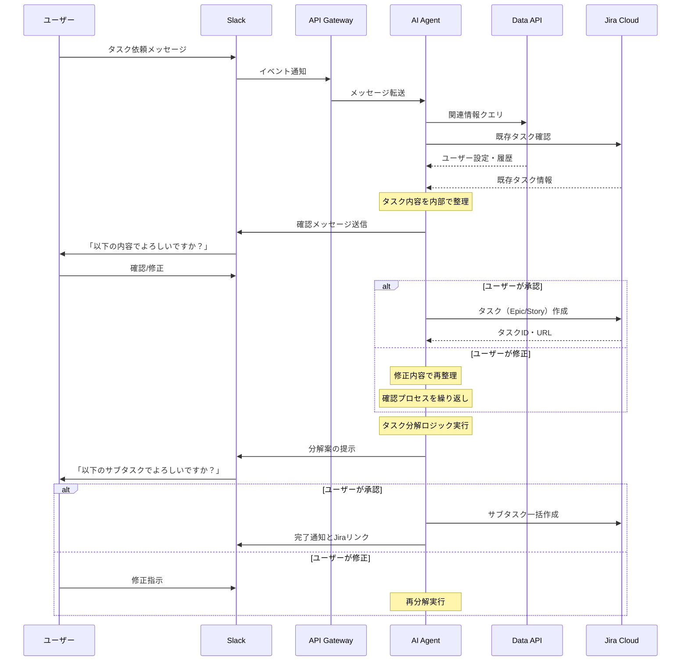

# アーキテクチャ概要

## システム構成図

## アーキテクチャ設計の指針

### 1. AI Agent中心設計
- **ユーザー指示はSlack経由（本番）またはWeb UI（開発用）**でAI Agentが受信
- AI Agent（Gemini CLI/Claude Code）が自律的に判断・実行
- AI Agent内部でコンテキスト収集・アクション決定・実行を一元管理
- データ収集は決められたルールで自動実行（AI介在なし）

### 2. タスク管理の一元化
- **すべてのタスクはJira Cloudで管理**（Task DBは使用しない）
- AI AgentがJira APIを直接操作
- タスクの作成、更新、分解はすべてJira上で実行

### 3. IoTデバイスの双方向制御
- データ収集だけでなく、**AI Agentからの制御も可能**
- カレンダー連携による自動制御
- ユーザーの行動パターンに基づく最適化

### 4. データ収集とアクセスの分離
- **Collector層**：デバイスからのデータを自動収集・格納（AIは介在しない）
  - Push型：認証が必要なデバイスからの能動的送信
  - Pull型：外部APIからの定期取得
  - ローカル型：Gateway不要のローカルネットワーク内収集
- **Data API層**：AI Agentがクエリを投げてデータを取得
  - 時系列データ、ヘルスデータ、行動ログへの統一的アクセス
  - AI Agentが必要なデータを自律的に判断して取得

### 5. セキュリティ・プライバシー考慮
- AI Agentには基本的に読み取り専用権限
- 制御が必要な場合のみ書き込み権限を付与
- 個人情報の暗号化とアクセス制御

## タスク分解フローの詳細

### Slackからのタスク登録・分解フロー

### フローの特徴

1. **対話的確認プロセス**
   - AIが整理した内容を必ずユーザーに確認
   - 修正が必要な場合は繰り返し対話

2. **段階的処理**
   - まずメインタスクをJiraに登録
   - その後、サブタスクに分解
   - 各段階でユーザー確認を実施

3. **柔軟な修正対応**
   - どの段階でもユーザーが介入可能
   - AIへのフィードバックループ

## 実装技術スタック

### バックエンド
- **言語**: Python (FastAPI) / Node.js (Express)
- **Data API**: GraphQL / REST API（柔軟なクエリに対応）
- **Collector**: 軽量なデータ収集デーモン
- **API Gateway**: Kong, Traefik
- **コンテナ**: Docker, Kubernetes

### データストレージ
- **時系列DB**: InfluxDB, TimescaleDB
- **リレーショナルDB**: PostgreSQL
- **ドキュメントDB**: MongoDB
- **キャッシュ**: Redis

### AI/ML
- **AI Agent**: Gemini CLI, Claude Code
- **外部AI API**: OpenAI API, Anthropic API, Google AI API（必要に応じて直接呼び出し）
- **画像処理**: Vision API（食事認識など）

### モニタリング・可観測性
- **メトリクス**: Prometheus + Grafana
- **ログ**: ELK Stack
- **トレーシング**: OpenTelemetry

### フロントエンド
- **Web UI**: React/Next.js
- **Slack App**: Bolt for Python/JavaScript
- **音声**: Web Speech API, Google Assistant SDK

## 要件と優先順位

### Phase 1: 基盤構築（優先度：高）

#### 1. タスク自動分解・スケジューリング機能
- **目的**: Jiraから大きなタスクを取得し、30分単位の実行可能なタスクに分解
- **実装内容**:
  - Jira APIとの完全統合
  - 対話的なタスク分解（段階的実装）:
    - Phase 1a: 専用Webインターフェースでの実装
    - Phase 1b: Slack統合への移行
  - コーディングタスクの設計/実装フェーズ分離
  - 分解されたタスクのJiraへの自動登録

#### 2. AIレビュー・品質管理システム
- **目的**: タスク完了基準の自動チェックと人間レビューの効率化
- **実装内容**:
  - タスクの受け入れ条件の自動検証
  - AIによる初期レビュー → 人間による最終確認フロー
  - 読み取り専用権限でのAI実行環境

#### 3. Slack統合チャットインターフェース
- **目的**: ChatGPTとのやり取りをSlack上で完結させ、履歴管理を改善
- **実装内容**:
  - Slack Block Kitを活用したリッチUI（表のコピーボタン等）
  - チャット履歴の管理・複製機能
  - Jira等とのシームレス連携
  - **Slack入力の自動タスク化**: メッセージからタスクを自動抽出・登録

#### 4. 日次タスク管理・繰り越しシステム
- **目的**: 未完了タスクの自動繰り越しと翌日計画の最適化
- **実装内容**:
  - 残タスクの自動次日繰り越し
  - バッファ時間を考慮した計画調整
  - 仕事（Jira）の行動結果の自動収集
  - プライベートサーバーへの活動ログ送信

### Phase 2: 拡張機能（優先度：中）

#### 5. 活動モニタリング統合システム
- **目的**: 多様なデバイスからタスク取り組み状況を自動追跡
- **実装内容**:
  - Android（アプリ使用状況、位置情報）
  - PC活動ログ
  - ウェアラブル端末（Galaxy Fit）データ統合
  - ポモドーロタイマー連携
  - 体重計・環境センサーデータ収集
  - 姿勢監視（UPRIGHT GO 2、カメラシステム）

#### 6. 振り返り自動化
- **目的**: Jira/カレンダーから情報を収集し、定期的な振り返りを支援
- **実装内容**:
  - 実績データの自動収集
  - Notion APIを使った定期レポート作成
  - 改善提案の自動生成

#### 7. IoT連携・自動化システム
- **目的**: Googleカレンダーと連動した生活環境の自動最適化
- **実装内容**:
  - アラーム自動設定
  - エアコン・照明の自動制御
  - スピーカーでのリマインダー
  - 体重計の自動記録

#### 8. GitHub対話型レビュー
- **目的**: PRレビューをAIとの対話形式で効率化
- **実装内容**:
  - GitHub APIとの連携
  - コメント/提案の対話的な生成
  - レビュー履歴の管理

#### 9. 長期目標管理システム
- **目的**: 3年単位の長期ロードマップと日々のタスクを連携
- **実装内容**:
  - JPD（Jira Product Discovery）連携
  - Epic/Story/Taskの階層管理
  - 四半期・半期単位でのマイルストーン追跡

### Phase 3: 高度な機能（優先度：低）

#### 10. ヘルスケア統合管理
- **目的**: 食事・薬・健康データの一元管理
- **実装内容**:
  - 食事写真からのVLM栄養分析
  - 服薬リマインダー・記録
  - 健康データの統合ダッシュボード
  - AIによる健康アドバイス

#### 11. 行動分析・改善提案
- **目的**: ブラウザ履歴等から行動パターンを分析し、改善を提案
- **実装内容**:
  - Chrome履歴の収集（暗号化対応）
  - X(Twitter)リンクのGrok連携
  - 新サービスアイデアの自動生成

#### 12. Notion MCP統合
- **目的**: Notionに蓄積された知識をAIが活用
- **実装内容**:
  - ドキュメント・要件定義書の参照
  - アイデアごとのリポジトリ管理
  - 資料のバージョン管理

#### 13. 統合ボットインターフェース
- **目的**: 全情報への単一アクセスポイント提供
- **実装内容**:
  - 全システムデータへの統合アクセス
  - コンテキストを考慮した相談機能
  - マルチモーダル対話（音声・テキスト・画像）

#### 14. 対話型UI最適化
- **目的**: ユーザーエクスペリエンスの向上
- **実装内容**:
  - パーソナライズされた対話インターフェース
  - o3等の高度なAIモデルとの履歴複製
  - カスタマイズ可能なアバター/キャラクター
