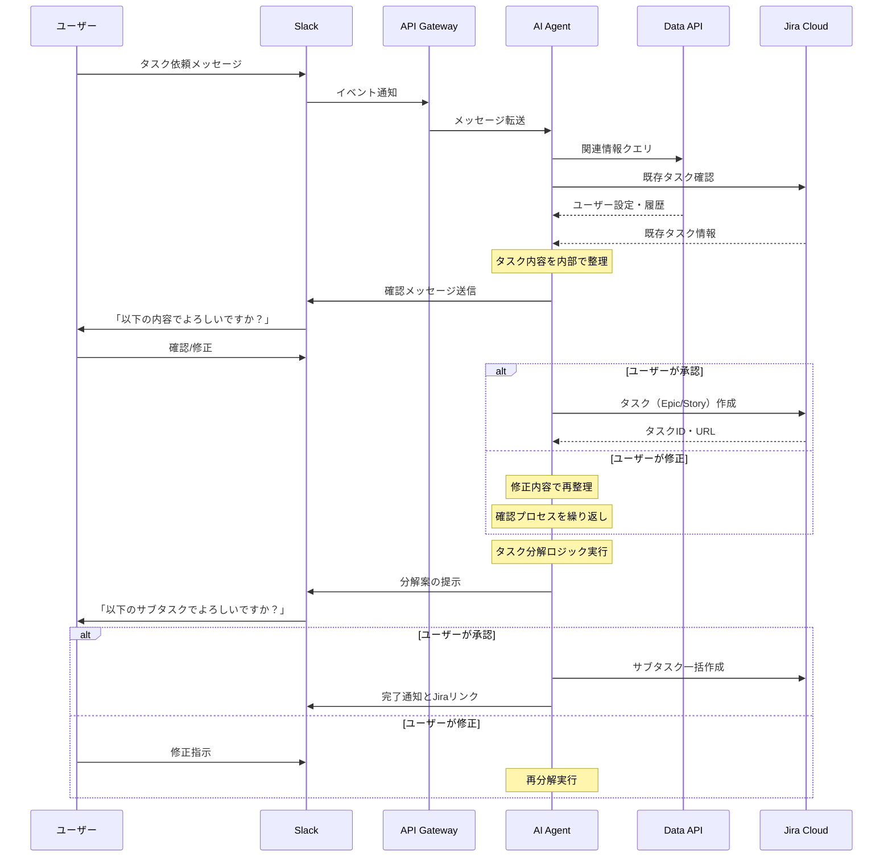

# Jiraタスク分解フロー

## Slackからのタスク登録・分解の詳細フロー

### フローの特徴

1. **対話的確認プロセス**
   - AIが整理した内容を必ずユーザーに確認
   - 修正が必要な場合は繰り返し対話

2. **段階的処理**
   - まずメインタスクをJiraに登録
   - その後、サブタスクに分解
   - 各段階でユーザー確認を実施

3. **柔軟な修正対応**
   - どの段階でもユーザーが介入可能
   - AIへのフィードバックループ